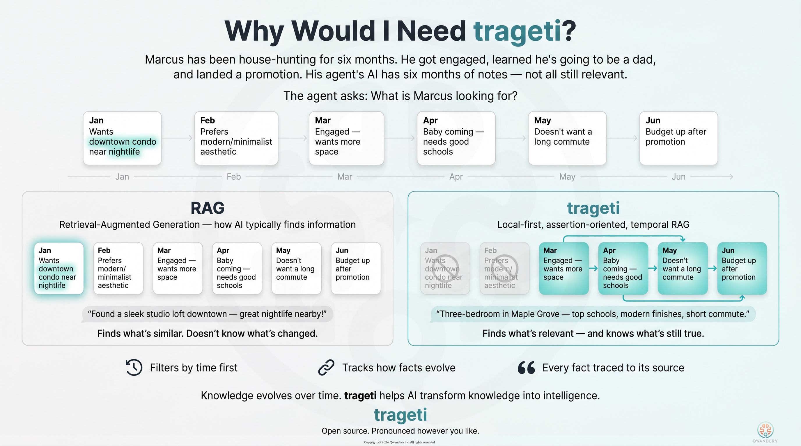

# trageti

Temporally-aware retrieval-augmented generation over SQLite.

`trageti` stores, indexes, and retrieves _episodic assertions_ — discrete, typed claims with explicit validity windows — with retrieval that respects temporal position as a first-class constraint alongside semantic similarity and full-text matching.

## Features

- **Temporal validity windows** — every assertion carries `validFrom` / `validUntil` positions; retrieval only returns claims that were current at the requested anchor
- **Hybrid retrieval** — semantic (cosine via sqlite-vec) + BM25 full-text + recency, combined by a pluggable scorer
- **Vectorless mode** — register a namespace with no embedding dimension and run BM25-only retrieval without installing `sqlite-vec`
- **Supersession chains** — replace a claim by writing its successor; history is preserved and queryable
- **Graph traversal** — follow typed links between assertions with depth limits and temporal filtering
- **Namespace isolation** — separate embedding tables per namespace, full data isolation
- **Schema extensions** — add custom columns or tables while keeping migration safety
- **Pluggable everything** — swap out the scorer, formatter, graph adapter, validator, logger, metrics, or middleware



## Installation

```bash
npm install trageti better-sqlite3
npm install sqlite-vec        # optional — only needed for vector retrieval
```

`sqlite-vec` is an **optional** peer dependency. Install it for hybrid or
vector retrieval; skip it entirely if you only need BM25-only (vectorless)
retrieval.

**Platform notes for sqlite-vec:**

- Node.js >= 18 required
- Pre-built binaries ship for Linux x64, macOS (arm64 + x64), and Windows x64
- For other platforms, see the [sqlite-vec documentation](https://alexgarcia.xyz/sqlite-vec)

## Quick start — hybrid retrieval

```typescript
import { TemporalStore } from 'trageti';

// create() opens the database, applies the v0.3 default pragmas
// (WAL, busy_timeout, temp_store), loads sqlite-vec, and runs init().
const store = await TemporalStore.create({
  database: 'my-store.db',
  namespace: 'my-namespace',
  embeddingDimension: 1536,
});

// Write an episode (provenance anchor).
await store.writeEpisode({
  id: 'ep-1',
  namespace: 'my-namespace',
  position: 1,
  occurredAt: new Date().toISOString(),
  type: 'document',
  content: 'Source document excerpt...',
});

// Write an assertion derived from the episode. Every assertion must carry
// at least one citation. Nullable fields (validUntil, supersedesId,
// entityId, entityType) may be omitted — they default to null.
await store.writeAssertion({
  id: 'a-1',
  namespace: 'my-namespace',
  type: 'fact',
  content: 'The system uses SQLite for storage.',
  validFrom: 1,
  confidence: 0.95,
  sourceEpisodeId: 'ep-1',
  citations: [
    {
      id: 'cit-1',
      episodeId: 'ep-1',
      sourceRef: 'chunk:1',
      excerpt: 'Source document excerpt mentioning SQLite for storage...',
    },
  ],
});

// Index with your embedding model.
const embedding = await myEmbeddingModel.embed('The system uses SQLite for storage.');
await store.indexAssertion('a-1', embedding);

// Retrieve — returns a { results, meta } envelope. Only assertions valid
// at temporalAnchor are returned.
const { results, meta } = await store.retrieve({
  namespace: 'my-namespace',
  queryEmbedding: embedding,
  queryText: 'storage solution',
  temporalAnchor: 1,
  limit: 10, // optional — defaults to 10
});
console.log(results.length, 'results via', meta.retrievalStrategy);

// Close when done. Because create() opened the database, close() closes it.
await store.close();
```

## Quick start — BM25-only (vectorless, no sqlite-vec)

Omit `embeddingDimension` to register a vectorless namespace. It needs no
`sqlite-vec` install and supports BM25-only retrieval.

```typescript
import { TemporalStore } from 'trageti';

const store = await TemporalStore.create({
  database: 'logs.db',
  namespace: 'logs',
  prepare: { loadSqliteVec: false }, // sqlite-vec not needed
});

await store.writeEpisode({
  /* ... */
});
await store.writeAssertion({
  /* ... */
});

const { results } = await store.retrieve({
  namespace: 'logs',
  queryText: 'connection timeout',
  temporalAnchor: 100,
  retrievalStrategy: 'bm25',
});

await store.close();
```

A vectorless namespace can be upgraded to vector-configured later with
`store.upgradeNamespaceToVector(namespace, { embeddingDimension })`.

## Lifecycle and the database handle

`TemporalStore.create()` is the recommended entry point. Ownership of the
database handle determines what `close()` does:

- `create({ database: 'file.db' })` — trageti opens the handle; `close()`
  closes it.
- `create({ database: existingDb })` — the caller owns the handle; `close()`
  leaves it open. Pass `closeDatabaseOnStoreClose: true` to delegate closing.

The low-level path remains available for callers that already manage a
`Database`:

```typescript
import Database from 'better-sqlite3';
import { TemporalStore, prepareDatabase } from 'trageti';

const db = prepareDatabase('my-store.db'); // applies pragmas, loads sqlite-vec
const store = new TemporalStore(db, { namespace: 'ns', embeddingDimension: 1536 });
await store.init();
```

The default connection verifier **enforces foreign keys**: it sets
`PRAGMA foreign_keys = ON`, re-checks it, and throws
`ConnectionVerificationError` if enforcement cannot be enabled.

## Core concepts

### Episodes

An `Episode` is a provenance anchor — a timestamped record that a piece of information was observed at a given `position` in the timeline. All assertions reference a source episode.

### Assertions

An `Assertion` is a discrete claim. Key fields:

- `validFrom` — the position at which this claim became current
- `validUntil` — the position at which it was superseded (null = still current)
- `confidence` — 0–1 reliability weight
- `entityId` / `entityType` — optional entity tagging for grouped queries

### Positions

`position` is a monotonically increasing numeric value (float). All temporal operations work relative to a `temporalAnchor` that you supply at query time. A position could represent document sequence number, timestamp, turn number, version, or any other ordinal.

### Supersession

When a claim changes, write the successor assertion with `supersedesId`
pointing at the prior one. The library **atomically** closes the
predecessor's `validUntil` in the same transaction — a single call:

```typescript
await store.writeAssertion({
  id: 'a-2',
  namespace: 'my-namespace',
  type: 'fact',
  content: 'The system now uses Postgres for storage.',
  validFrom: 5,
  supersedesId: 'a-1', // atomically sets a-1.validUntil = 5
  sourceEpisodeId: 'ep-5',
  confidence: 0.95,
  citations: [{ id: 'cit-2', episodeId: 'ep-5', sourceRef: 'chunk:9', excerpt: '...' }],
});
```

Queries at `validAt < 5` still see `a-1`; queries at `validAt >= 5` do not.

For the rare no-replacement case (a data correction where the predecessor is
simply wrong and nothing supersedes it), use the escape hatch
`store.advanced.closeAssertion(assertionId, { validUntil })`.

## Retrieval

```typescript
const { results, meta } = await store.retrieve({
  namespace: 'my-namespace',
  queryEmbedding: embedding, // optional
  queryText: 'storage solution', // optional — enables BM25 scoring
  queryTextMode: 'phrase', // default — escapes FTS5 operators
  retrievalStrategy: 'hybrid', // default — 'hybrid' | 'vector' | 'bm25'
  temporalAnchor: 10,
  limit: 20,
  minConfidence: 0.7, // optional filter
  entityTypes: ['concept'], // optional filter
  expandLinks: true, // attach graph neighbours
  maxDepth: 2,
  mode: 'snapshot', // or 'trajectory' — see below
});
```

`retrieve()` returns a `RetrievalResult` envelope:

- `results` — the ranked `RetrievedAssertion[]`; each carries `score` and
  `scoreComponents` (`semanticDistance`, `bm25Score`, `position`).
- `meta` — `{ namespace, temporalAnchor, limit, candidateCount,
retrievalStrategy, vectorApplied, bm25Applied, queryTextMode, tookMs,
warnings }`.

### Retrieval strategies

- `hybrid` (default) — use vector and BM25 signals when available.
- `vector` — semantic only; requires `queryEmbedding`.
- `bm25` — keyword only; requires `queryText`; never needs `sqlite-vec`.

### Query text modes

- `phrase` (default) — user input is wrapped as a literal FTS5 phrase;
  operators like `AND` / `OR` / `NEAR` are treated as text. Safe for
  untrusted input.
- `fts5` — raw FTS5 syntax; operators are interpreted. Use only with
  trusted, well-formed queries.

### Trajectory mode

`mode: 'trajectory'` adds the supersession history of each result:

```typescript
const { results } = await store.retrieve({
  namespace: 'my-namespace',
  queryEmbedding: embedding,
  temporalAnchor: 10,
  mode: 'trajectory',
});

for (const r of results) {
  // r.supersessionChain is always present in trajectory mode — the prior
  // versions of r in chronological order (oldest first), each with its own
  // citations. Empty array means no predecessors. Absent in snapshot mode.
  console.log(r.supersessionChain?.map((a) => a.id));
}
```

Trajectory mode follows `supersedes_id` chains only — it does **not**
traverse links. For accumulation/layering relationships use
`expandLinks: true` together with `getEntityHistory()`.

Quick reference for the four "history-shaped" calls:

- `mode: 'trajectory'` — replacement history of _retrieved_ results.
- `expandLinks: true` — assertions related to a result via links.
- `getEntityHistory(ns, entityId)` — every assertion ever written for an entity.
- `getEntityTrajectory(ns, entityId)` — supersession chain(s) for an entity.

### Choosing supersession vs links

When new information arrives about an entity, decide first whether it
_replaces_ an earlier assertion or _layers on top of_ it:

- **Replacement** — a status flips, a goal is met, an arrangement ends.
  Write the successor with `supersedesId: <prior>`. The predecessor is
  atomically closed and drops out of snapshot retrieval.
- **Accumulation** — a theme deepens, a contradictory belief coexists, a new
  measurement extends a series. Write the new assertion with no
  `supersedesId`. Both remain valid. Connect them with `writeLink({
linkType: 'deepens' | 'qualifies' | 'contextualizes' | 'contradicts' |
'measures' })`.

Setting `supersedesId` is a strong replacement signal — when in doubt, prefer
`writeLink` and keep both assertions valid.

## Citations

Every assertion must carry at least one citation. Citations are the source
references that make retrieval results traceable.

```typescript
await store.writeAssertion({
  id: 'a-1',
  // ...other fields...
  citations: [
    {
      id: 'cit-1',
      episodeId: 'ep-1',
      sourceRef: 'chunk:3', // caller-defined; opaque to library
      excerpt: 'verbatim source text', // strongly recommended; null permitted
      excerptStart: '0:08:14', // optional positional anchors
      excerptEnd: '0:08:51',
      metadata: { confidence: 0.95 }, // optional caller data
    },
  ],
});
```

If you discover a citation after the assertion has been written, add it via
`await store.writeCitation({ ... })`. Citations are populated on every read
path (`getAssertions`, `retrieve`, `getEntityHistory`, etc.).

`null` excerpts are permitted but emit a `TRGT_CITATION_EXCERPT_MISSING`
warning at write time. Construct `DefaultAssertionValidator` with
`{ requireCitationExcerpt: true }` to promote that to a hard validation
error instead.

## Embedding providers

An `EmbeddingProvider` lets the store derive embeddings from text (for
indexing and for provider-derived query embeddings):

```typescript
interface EmbeddingProvider {
  readonly name: string;
  readonly dimension: number;
  embed(texts: readonly string[], options?: EmbedOptions): Promise<Float32Array[]>;
}
```

Core ships two providers:

- `MockEmbeddingProvider` — deterministic hashed embeddings for tests and
  quickstarts only (not suitable for real semantic retrieval).
- `RawVectorProvider` — for callers that already have embeddings on hand.

```typescript
import { MockEmbeddingProvider } from 'trageti';

const store = await TemporalStore.create({
  database: 'my-store.db',
  namespace: 'ns',
  embeddingDimension: 384,
  embeddingProvider: new MockEmbeddingProvider({ dimension: 384 }),
});
```

## Context assembly

`assembleContext` runs `retrieve` and formats the results for a prompt:

```typescript
const ctx = await store.assembleContext({
  namespace: 'my-namespace',
  queryEmbedding: embedding,
  temporalAnchor: 10,
  tokenBudget: 4000,
  formatter: new JsonFormatter(), // or ProseFormatter / StructuredFormatter
});
// ctx.text     — formatted string ready for prompt injection
// ctx.truncated — true if token budget was exceeded
// ctx.coverage  — { totalAssertions, includedAssertions, positionRange }
```

### Formatters

| Class                 | Output                                                   |
| --------------------- | -------------------------------------------------------- |
| `ProseFormatter`      | Narrative text, one paragraph per assertion + provenance |
| `StructuredFormatter` | Grouped by entityType then position                      |
| `JsonFormatter`       | JSON array of assertion objects                          |

## Graph traversal

```typescript
// Find assertions connected to a-1 within 2 hops
const connected = await store.getConnected({
  namespace: 'my-namespace',
  fromAssertionId: 'a-1',
  maxDepth: 2,
  linkTypes: ['related', 'sequential'], // optional filter
  temporalAnchor: 10,
});

// Find shortest path between two assertions
const path = await store.findPath({
  namespace: 'my-namespace',
  fromAssertionId: 'a-1',
  toAssertionId: 'a-5',
  maxDepth: 5,
  temporalAnchor: 10,
});
```

Links carry their own `validFrom` / `validUntil` — expired links are automatically excluded.

`maxDepth` is optional: it defaults to `3` for `getConnected` and `5` for `findPath`. `getConnected` returns its neighborhood in a deterministic order (traversal depth, then link `createdAt`, then `id`), so repeated calls are reproducible.

## Temporal snapshots

Get all assertions valid at a specific past position:

```typescript
const snapshot = await store.getTemporalSnapshot({
  namespace: 'my-namespace',
  atPosition: 5,
  assertionTypes: ['fact', 'update'], // optional
  entityTypes: ['concept'], // optional
});
```

By default `getTemporalSnapshot` returns the single version of each assertion valid _at_ `atPosition`. Pass `includeSuperseded: true` to also get versions that were already closed by `atPosition` (every assertion with `validFrom <= atPosition`).

## Logging and metrics

Pass a `Logger` to capture structured records, and a `Metrics` sink for
counters/observations:

```typescript
const store = await TemporalStore.create({
  database: 'my-store.db',
  namespace: 'ns',
  embeddingDimension: 1536,
  logger: {
    debug: () => {},
    info: (code, fields) => myObservability.info(code, fields),
    warn: (code, fields) => myObservability.warn(code, fields),
    error: (code, fields) => myObservability.error(code, fields),
  },
});
```

The default logger (`ConsoleLogger`) writes `warn`/`error` records to stderr.
`NoopLogger` silences the library. `Metrics` has no default implementation —
emission is a guarded no-op when unset.

## Schema extensions

Add custom columns or tables without breaking migrations:

```typescript
const store = await TemporalStore.create({
  database: 'my-store.db',
  namespace: 'my-namespace',
  embeddingDimension: 1536,
  schemaExtensions: {
    columns: [{ table: 'trageti_assertions', column: 'source_url', definition: 'TEXT' }],
    tables: [
      {
        tableName: 'my_custom_metadata',
        createSQL: `
          CREATE TABLE IF NOT EXISTS my_custom_metadata (
            assertion_id TEXT NOT NULL REFERENCES trageti_assertions(id),
            tag          TEXT
          )
        `,
        referencesNamespace: false,
      },
    ],
  },
});
```

Extension column values appear on returned assertion objects under `assertion.extensions`.

Constraints:

- Column names must not shadow library columns or be SQLite reserved words
- Table names must not use the library table prefix
- Extension tables that reference a namespace must declare `namespaceColumn`,
  validated against `PRAGMA table_info` at `init()` time
- Extensions are applied idempotently on every `init()`

## Middleware

```typescript
const loggingMiddleware: RetrievalMiddleware = {
  before: (query) => {
    console.log('retrieving at anchor', query.temporalAnchor);
    return query;
  },
  after: (results) => {
    console.log('got', results.length, 'results');
    return results;
  },
};

const store = await TemporalStore.create({
  database: 'my-store.db',
  namespace: 'my-namespace',
  embeddingDimension: 1536,
  middleware: [loggingMiddleware],
});
```

Middleware runs: global `before` (registration order) → per-call `before` →
retrieval core → per-call `after` (reverse) → global `after` (reverse).
`after` hooks transform the `results` array; the `meta` envelope is preserved.

## Custom scorer

```typescript
import type { RetrievalScorer, ScoredCandidate, ScoringContext } from 'trageti';

class MyScorer implements RetrievalScorer {
  score(candidate: ScoredCandidate, ctx: ScoringContext): number {
    const range = ctx.namespacePositionRange.max - ctx.namespacePositionRange.min || 1;
    return (candidate.position - ctx.namespacePositionRange.min) / range;
  }
}

const store = await TemporalStore.create({
  database: 'my-store.db',
  namespace: 'my-namespace',
  embeddingDimension: 1536,
  scorer: new MyScorer(),
});
```

`ScoredCandidate.semanticDistance` and `bm25Score` are each `number | null`:
`semanticDistance` is null for a BM25-only candidate, `bm25Score` is null for
a vector-only candidate. A scorer with no usable signal should throw. For
cross-candidate normalisation implement the optional `scoreBatch` hook (the
pipeline calls it instead of per-candidate `score()` and validates the
returned array length); `DefaultScorer.scoreBatch` is a worked reference.

## Migrations

`trageti` manages its own schema via an internal migration runner. Migrations
are applied automatically on `init()` and are idempotent.

```typescript
const version = await store.getCurrentSchemaVersion();
```

## Reindexing and FTS maintenance

`reindexNamespace` rebuilds a namespace's vector index (for example, when
changing embedding dimensions) using a staging-swap: it builds a fresh index
and atomically swaps it in, so a provider failure leaves the previous index
intact.

```typescript
await store.reindexNamespace('my-namespace', {
  newDimension: 3072,
  embeddingProvider: myEmbeddingProvider,
});
```

`rebuildFts` drops and recreates the full-text index — useful to change the
tokenizer or repair the index — preserving the rowid join used for BM25:

```typescript
await store.rebuildFts({ tokenizer: { tokenizer: 'porter', tokenizerArgs: ['unicode61'] } });
```

`getPendingIndexing(namespace)` lists assertions that have no embedding yet.

## Multiple namespaces

A single database can host multiple namespaces, each with isolated data and
its own embedding table:

```typescript
await store.initNamespace('team-b', { embeddingDimension: 768 });
```

## Known limitations

- **Single-process writes** — no multi-writer coordination. If multiple processes write to the same database concurrently, use an external lock or connection pool with serialised writes.
- **Graph traversal at scale** — the default `CTEGraphAdapter` uses recursive CTEs which can be slow on dense graphs. Implement a custom `GraphQueryAdapter` for large-scale graph workloads.
- **`findPath` finds one path** — it returns the first shortest path found by BFS. It does not enumerate all paths.

## Sponsorship

If `trageti` is useful to your work, you can support ongoing development
through [GitHub Sponsors](https://github.com/sponsors/qwandery).

## License

MIT
